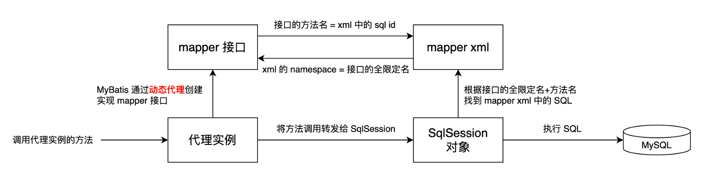

# MyBatis入门

[TOC]

## 第一个MyBatis程序：使用非Mapper接口方式执行CURD

### 所需依赖

因为mybatis能代替繁琐的JDBC操作，底层还是基于JDBC实现的，所以需要driver去连接数据库，那么所需的依赖包括：mybatis和mysql-connector-java

```xml
<dependency>
    <groupId>org.mybatis</groupId>
    <artifactId>mybatis</artifactId>
    <version>xxx</version>
</dependency>
<dependency>
    <groupId>mysql</groupId>
    <artifactId>mysql-connector-java</atifactId>
    <version>xxx</version>
</dependency>
```

### 创建核心配置文件

核心配置文件主要定义数据库连接所必需的属性，包括driver、username、password、url等等。

除此之外定义了所含有的mappers。

配置文件的名称并不做要求。

```xml
<?xml version="1.0" encoding="UTF-8" ?>
<!DOCTYPE configuration
        PUBLIC "-//mybatis.org//DTD Config 3.0//EN"
        "https://mybatis.org/dtd/mybatis-3-config.dtd">
<configuration>
    <properties resource="jdbc.properties"/>
    <environments default="development">
        <environment id="development">
            <transactionManager type="JDBC"/>
            <dataSource type="POOLED">
                <property name="driver" value="${jdbc.driver}"/>
                <property name="url" value="${jdbc.url}"/>
                <property name="username" value="${jdbc.user}"/>
                <property name="password" value="${jdbc.password}"/>
            </dataSource>
        </environment>
    </environments>
    <mappers>
        <mapper resource="AccountMapper.xml"/>
    </mappers>
</configuration>
```

### 定义POJO类

```java
@Data
public class Account {
    String name;
    Long id;
    BigDecimal balance;
}
```

### 创建并编辑SQL映射文件xxxMapper.xml

namespace命名不做要求，其中的id命名也不做要求，namespace.id的作用是定位这条sql语句，所以必须唯一。

resultType是所返回的类型，必须采用全限定类名，后续也可用别名代替。

```xml
<?xml version="1.0" encoding="UTF-8" ?>
<!DOCTYPE mapper
        PUBLIC "-//mybatis.org//DTD Mapper 3.0//EN"
        "https://mybatis.org/dtd/mybatis-3-mapper.dtd">
<mapper namespace="AccountMapper">
    <select id="selectUserById" resultType="com.lazyben.pojo.Account">
        select * from account where id = #{id}
    </select>
    <select id="selectAllUsers" resultType="com.lazyben.pojo.Account">
        select * from account
    </select>
    <update id="updateUser">
        update account set balance = balance+100 where id = #{id}
    </update>
</mapper>
```

### 编写测试进行CURD

由于是基于xml配置文件的mybatis，所以构建SqlSessionFactory时需要读取该xml文件，这是我们自己控制的，所以xml文件的命名不做要求。

selectOne根据namespace.id确定唯一的sql语句执行。

```java
@Test
public void selectUserByIdTest() throws IOException {
    String resource = "mybatis-config.xml";
    InputStream inputStream = Resources.getResourceAsStream(resource);
    SqlSessionFactory sqlSessionFactory = new SqlSessionFactoryBuilder().build(inputStream);
    try (SqlSession sqlSession = sqlSessionFactory.openSession()) {
        Account account = sqlSession.selectOne("AccountMapper.selectUserById", 2);
        System.out.println(account);
    }
}
```

**执行插入、更新、删除后，需要手动提交事务**

```java
@Test
public void updateUser() throws IOException {
    String resource = "mybatis-config.xml";
    InputStream inputStream = Resources.getResourceAsStream(resource);
    SqlSessionFactory sqlSessionFactory = new SqlSessionFactoryBuilder().build(inputStream);
    try (SqlSession sqlSession = sqlSessionFactory.openSession()) {
        int updateCount = sqlSession.update("AccountMapper.updateUser", 2);
        System.out.println(updateCount);
        sqlSession.commit();
    }
}
```

## 使用Mapper接口方式执行SQL

### 使用非Mapper接口方式执行SQL的弊端

- 调用SQL依赖字符串字面量，容易出错
- 参数设置不清晰
- 如果不小心输错，编译期间无法发现，执行时才会发现

### 使用Mapper接口方式执行SQL

#### 定义Mapper接口

```java
public interface AccountMapper {
    Account selectUserById(long id);

    List<Account> selectAllUsers();

    int updateUser();
}
```

#### 修改xxxMapper.xml

与之前不同的是namespace要是Mapper接口的全限定类名。

```xml
<?xml version="1.0" encoding="UTF-8" ?>
<!DOCTYPE mapper
        PUBLIC "-//mybatis.org//DTD Mapper 3.0//EN"
        "https://mybatis.org/dtd/mybatis-3-mapper.dtd">
<mapper namespace="com.lazyben.mapper.AccountMapper">
    <select id="selectUserById" resultType="com.lazyben.pojo.Account">
        select * from account where id = #{id}
    </select>
    <select id="selectAllUsers" resultType="com.lazyben.pojo.Account">
        select * from account
    </select>
    <update id="updateUser">
        update account set balance = balance+100 where id = #{id}
    </update>
</mapper>
```

#### 编写测试

调用 SqlSession 的 getMapper 方法，传入mapper 接口类型为入参，获取mapper接口的实现类实例。

调用mapper接口定义的方法执行sql。

```java
@Test
public void selectUserByIdUseMapperInterfaceTest() throws IOException {
    String resource = "mybatis-config.xml";
    InputStream inputStream = Resources.getResourceAsStream(resource);
    SqlSessionFactory sqlSessionFactory = new SqlSessionFactoryBuilder().build(inputStream);
    try (SqlSession sqlSession = sqlSessionFactory.openSession()) {
        AccountMapper mapper = sqlSession.getMapper(AccountMapper.class);
        Account account = mapper.selectUserById(2);
        System.out.println(account);
    }
}
```

### getMapper实现原理

- 调用getMapper方法时，MyBatis使用动态代理技术生成mapper接口的实例
- 生成的mapper接口实例会拦截所有方法调用，并将方法转发给SqlSession
- SqlSession调用与mapper接口对应的mapper xml中的SQL语句（底层还是使用namespace.id确定唯一的sql语句执行方啊）。



## Mybatis核心配置文件

### properteis

用键值对的方式配置属性值，用配置的属性替换配置文件中的值。

- 方案1（不推荐）

```xml
<!--核心配置文件部分配置信息-->
<properties>
  	<property name="jdbc.driver", value="com.mysql.cj.jdbc.Driver">
    <property name="jdbc.url", value="jdbc:mysql://127.0.0.1:3306/bank?useSSL=false">
    <property name="jdbc.user", value="root">
    <property name="jdbc.password", value="123">
</properties>

<environments default="development">
    <environment id="development">
        <transactionManager type="JDBC"/>
        <dataSource type="POOLED">
            <property name="driver" value="${jdbc.driver}"/>
            <property name="url" value="${jdbc.url}"/>
            <property name="username" value="${jdbc.user}"/>
            <property name="password" value="${jdbc.password}"/>
        </dataSource>
    </environment>
</environments>
```

- 方案2

核心配置文件部分配置信息：

```xml
<!--核心配置文件部分配置信息-->
<properties resource="jdbc.properties"/>

<environments default="development">
    <environment id="development">
        <transactionManager type="JDBC"/>
        <dataSource type="POOLED">
            <property name="driver" value="${jdbc.driver}"/>
            <property name="url" value="${jdbc.url}"/>
            <property name="username" value="${jdbc.user}"/>
            <property name="password" value="${jdbc.password}"/>
        </dataSource>
    </environment>
</environments>
```

```properties
#jdbc.properties
jdbc.driver=com.mysql.cj.jdbc.Driver
jdbc.user=root
jdbc.password=123
jdbc.url=jdbc:mysql://127.0.0.1:3306/bank?useSSL=false
```

- 为什么推荐配置properties文件的方式去配置属性值？多环境！

涉及Maven多环境。

### typeAlias

类型别名可以为Java类型设置一个缩写名字，意在降低全限定类名的冗余书写。

```xml
<!--核心配置文件部分配置信息-->
<typeAliases>
    <typeAlias type="com.lazyben.pojo.Account" alias="account"/>
</typeAliases>
```

```xml
<!--xxxMapper.xml部分信息-->
<select id="selectUserById" resultType="account">
    select * from account where id = #{id}
</select>
```

一个个 typeAlias 的编写还是太麻烦，可以指定一个包下的所有的类名为别名

```xml
<!--核心配置文件部分配置信息-->
<typeAliases>
    <package name="com.lazyben.pojo"/>
</typeAliases>
```

### enviroments

- MyBatis 可以通过 environments 实现多环境的，但一般我们不用这种方式实现，而使用不同环境 properties 文件来实现多环境。因此我们一般只配置一个environment。

- environment 下可以配置 transactionManager 和 dataSource

  ```xml
  <!--核心配置文件部分配置信息-->
  <environments default="development">
      <environment id="development">
          <transactionManager type="JDBC"/>
          <dataSource type="POOLED">
              <property name="driver" value="${jdbc.driver}"/>
              <property name="url" value="${jdbc.url}"/>
              <property name="username" value="${jdbc.user}"/>
              <property name="password" value="${jdbc.password}"/>
          </dataSource>
      </environment>
  </environments>
  ```

  - transactionManager：事务管理器， MyBatis 中有两种类型的事务管理器 JDBC | MANAGED

    - JDBC – 这个配置直接使用了 JDBC 的提交和回滚功能

    - MANAGED – 这个配置几乎没做什么。从不提交或回滚一个连接，而是让容器来管理事务的整个生命周期

    - 如果你正在使用 Spring + MyBatis，则没有必要配置事务管理器，因为 Spring 模块会使用自带的管理器来覆盖前面的配置

  - dataSource：数据源配置

    - type ，数据源类型，MyBatis 支持三种数据源类型 UNPOOLED | POOLED | JNDI

      - UNPOOLED，不使用连接池，每次请求时打开和关闭连接

      - POOLED，使用连接池

      - JNDI，这个数据源实现是为了能在如 EJB 或应用服务器这类容器中使用，容器可以集中或在外部配置数据源，然后放置一个 JNDI 上下文的数据源引用。

    - property 主要包含数据库连接配置，driver、url、username、password

### mappers

- 方式一

  ```xml
  <mappers>
      <mapper resource="AccountMapper.xml"/>
  </mappers>
  ```

- 方式二

  ```xml
  <mappers>
      <mapper class="com.lazyben.mapper.AccountMapper"/>
  </mappers>
  ```

- 方式三

  将包内映射器全部注册为映射器

  ```xml
  <mappers>
      <package name="com.lazyben.mapper"/>
  </mappers>
  ```

**如果使用方式2和方式3，要求 mapper xml 文件和 mapper 接口类所在的路径要完全相同**

