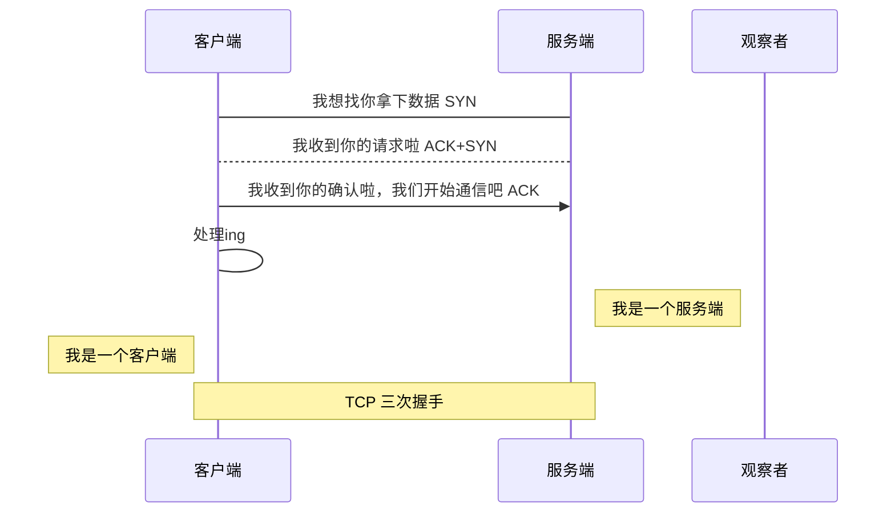

# 目录

[TOC]

# 问题

- 什么是Aop？
- Spring Aop实现原理？
- 切面、切点、通知、连接点、织入、目标对象、代理对象，这些概念什么意思？
- 需要哪些依赖？如何配置？怎么声明一个切面？
- 通知有哪些类型？分别对应什么注解？环绕通知在参数上有什么不同？如果有异常抛出哪些通知不会执行？
- 怎么使用通用切点？
- 怎么使用自定义的注解来定义切点？

## nihao 

nihao nihao nihao nihao nihao nihao 

## hihi

adcdcsdc

- [ ] hi
- [x] joo

:smile:

H~2~O

