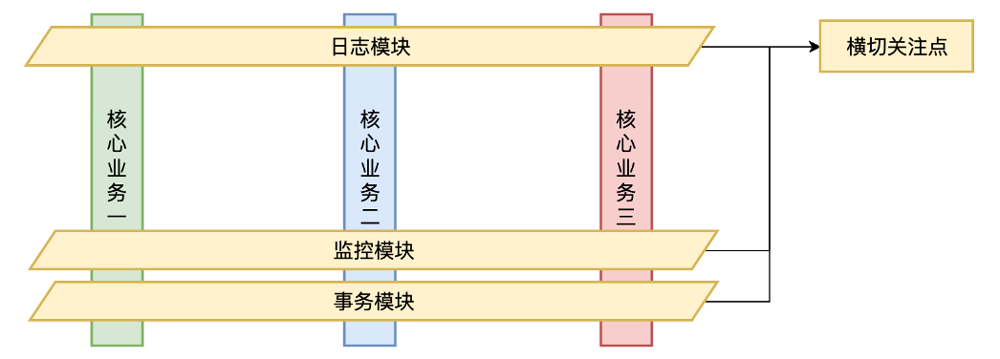
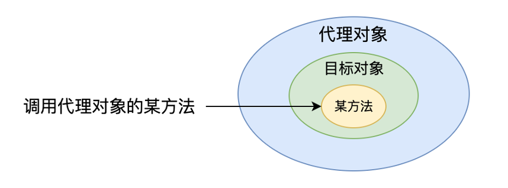
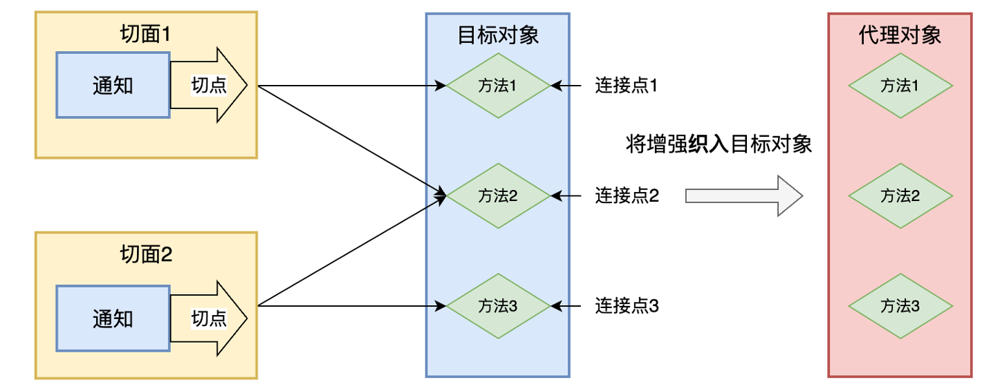
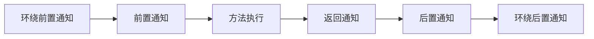
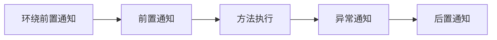

# Spring AOP

[代码地址](https://github.com/lazyben-pg/spring-learn/tree/main/spring-aop)

[TOC]

## AOP介绍

- AOP，Aspect-Oriented Programming，面向切面编程。AOP 是一种编程范式，它通过将横切关注点从业务逻辑中分离出来，以模块化的方式实现了横切关注点的复用。AOP 的核心思想是将横切关注点抽象成切面（Aspect），然后通过编织（Weaving）的方式将切面与业务逻辑进行组合，从而实现横切关注点的复用。

  - 在纵向，不同的核心业务模块实现不同的业务功能。

  - 在横向，不同的核心业务模块中有一些与具体业务逻辑无关，但有反复出现的功能，可以抽象一个切面：一个横跨多个对象的关注点。例如日志、监控、事务等。把这些功能抽象成单独模块，一方面可以提升代码复用度，一方面可以让程序员专注于编写核心业务。



## AOP的好处

- 代码复用

  AOP 可以将通用的功能逻辑抽象成切面，然后将切面与业务逻辑进行组合，从而实现了横切关注点的复用。这样，我们可以将通用的功能逻辑抽象成切面，然后在多个模块中进行复用，从而提高了代码的可重用性。

- 松耦合

  AOP 不侵入业务代码，将横切关注点从业务逻辑中分离出来，提升了代码的可维护性、可扩展性、可读性。

## Spring AOP实现原理

- AOP 的本质是对目标类方法的增强。目标类的方法只实现业务逻辑，AOP 来完成其他增强逻辑。

- Spring AOP 使用动态代理来实现，即 Spring 在运行时创建代理对象，代理对象会将方法调用转发给目标对象，并提供方法增强。Spring AOP 的动态代理有两种方式：

  - 基于接口的代理，使用 JDK 动态代理实现，要求目标对象实现接口。

  - 基于类的代理，使用 CGLIB 动态代理实现。

  

## AOP核心术语

- 切面（Aspect）：切面是横切关注点的抽象，它包含了切点和通知。切面定义了在哪些地方（切点）以及何时执行哪些增强操作（通知）。

- 切点（Pointcut）：切点是指在哪些地方应该执行切面的增强操作。（理解成需要增强的一堆方法）

- 通知（Advice）：通知是切面的具体实现，又叫增强，它定义了增强操作的具体行为，是我们抽取出来的共性功能。通知分为：前置通知、后置通知、环绕通知、异常通知、最终通知。

- 连接点（Joinpoint）：连接点是在应用执行过程中能够插入切面的一个点，例如方法调用、方法执行、异常处理等。连接点是切点的基础，切点定义了在哪些连接点上应该执行切面的增强操作。（理解成一个方法）

- 织入（Weaving）：织入是将切面应用到目标对象上的过程。

- 目标对象（Target）：被织入增强的对象。

- 代理对象（Proxy）：一个目标对象被织入增强后产生的新对象。



## 通知Advice的类型

- 前置通知（Before Advice）：在目标方法执行前执行的通知。

- 后置通知（After Advice）：在目标方法执行后执行的通知。

- 返回通知（After Returning Advice）：在目标方法执行后返回结果时执行的通知。

- 异常通知（After Throwing Advice）：在目标方法抛出异常时执行的通知。

- 环绕通知（Around Advice）：在目标方法执行前后都执行的通知。

### 目标方法正常返回通知执行顺序



### 目标方法异常返回通知执行顺序

- 目标方法抛异常，异常通知才会执行。

- 如果目标方法抛异常，返回通知、后环绕通知不会执行，但后置通知会执行。



### 返回通知后置通知的区别

- 返回通知是在目标方法执行后返回结果时执行的通知，只有目标方法正常返回时才会执行，抛异常则不会执行。**返回通知可以访问目标方法的返回值，并可以修改返回值。**

- 后置通知是在目标方法执行后执行的通知，无论目标方法是否抛出异常，后置通知都会执行。后置通知无法访问目标方法的返回值或抛出的异常。

- 因此，后置通知和返回通知的区别在于它们的执行时机和作用。后置通知无法访问目标方法的返回值或抛出的异常，而返回通知可以访问目标方法的返回值，并可以修改返回值。在实际应用中，我们需要根据具体的需求选择使用后置通知还是返回通知。

## Spring AOP实现

### 所需依赖

```xml
<dependency>
    <groupId>org.springframework</groupId>
    <artifactId>spring-context</artifactId>
</dependency>
<dependency>
    <groupId>org.springframework</groupId>
    <artifactId>spring-aspects</artifactId>
</dependency>
```

### 配置项

需要在核心配置类上加上@EnableAspectJAutoProxy，开启允许切面自动代理。

```java
@Configuration
@ComponentScan("com.lazyben")
@EnableAspectJAutoProxy
public class SpringConfiguration {
}
```

### Aspect声明

- @Aspect表示这是一个切面

- 使用@Before、@After、@AfterReturning、@AfterThrowing、@Around标识不同的通知。
- 通知注解中的值表示切点，用于表示这个通知需要增强哪一个方法。

```java
@Component
@Aspect
public class MyAspect {
    @Before("execution(* com.lazyben.service.UserService.*(..))")
    public void before(){
        System.out.println("before method invoke");
    }

    @After("execution(* com.lazyben.service.UserService.*(..))")
    public void after(){
        System.out.println("after method invoke");
    }

    @AfterReturning("execution(* com.lazyben.service.UserService.*(..))")
    public void afterReturning(){
        System.out.println("afterReturning");
    }

    @AfterThrowing("execution(* com.lazyben.service.UserService.*(..))")
    public void afterThrowing(){
        System.out.println("afterThrowing");
    }

    @Around("execution(* com.lazyben.service.UserService.*(..))")
    public Object around(ProceedingJoinPoint joinPoint) throws Throwable {
        System.out.println("around before");
        Object proceed = joinPoint.proceed();
        System.out.println("around after");
        return proceed;
    }
}
```

### 通用切点

每一个通知中我们都要写复杂的切点，难免会出现错误，也比较冗余，可以使用一个通用的切点去代替。

```java
@Component
@Aspect
public class MyAspectWithGnernalPointCut {
    @Before("generalPointCut()")
    public void before(){
        System.out.println("before method invoke");
    }

    @After("generalPointCut()")
    public void after(){
        System.out.println("after method invoke");
    }

    @AfterReturning("generalPointCut()")
    public void afterReturning(){
        System.out.println("afterReturning");
    }

    @AfterThrowing("generalPointCut()")
    public void afterThrowing(){
        System.out.println("afterThrowing");
    }

    @Around("generalPointCut()")
    public Object around(ProceedingJoinPoint joinPoint) throws Throwable {
        System.out.println("around before");
        Object proceed = joinPoint.proceed();
        System.out.println("around after");
        return proceed;
    }

    @Pointcut("execution(* com.lazyben.service.UserService.*(..))")
    public void generalPointCut(){}
}
```

### 使用注解定义切点

使用通用切点还是不够灵活，可以使用注解定义切点，在想增强的方法上使用相应注解就方便多了。

#### 新增注解

```java
@Target(ElementType.METHOD)
@Retention(RetentionPolicy.RUNTIME)
public @interface MyAnnotation {
}
```

#### 修改切面

```java
@Component
@Aspect
public class MyAspectWithAnnotation {
    @Before("generalPointCut()")
    public void before() {
        System.out.println("before method invoke");
    }

    @After("generalPointCut()")
    public void after() {
        System.out.println("after method invoke");
    }

    @AfterReturning("generalPointCut()")
    public void afterReturning() {
        System.out.println("afterReturning");
    }

    @AfterThrowing("generalPointCut()")
    public void afterThrowing() {
        System.out.println("afterThrowing");
    }

    @Around("generalPointCut()")
    public Object around(ProceedingJoinPoint joinPoint) throws Throwable {
        System.out.println("around before");
        Object proceed = joinPoint.proceed();
        System.out.println("around after");
        return proceed;
    }

    @Pointcut("@annotation(com.lazyben.annotation.MyAnnotation)")
    public void generalPointCut() {
    }
}
```

#### 在相应方法上使用注解

```java
@Service
public class UserService {
    @MyAnnotation
    public void getUserById(long id) {
        System.out.println("getUserById invoke");
    }

    @MyAnnotation
    public void getUserByName(String name) {
        System.out.println("getUserByName invoke");
    }
}
```

## Spring AOP实战（实现方法执行日志打印）

### 新增注解

```java
@Target(ElementType.METHOD)
@Retention(RetentionPolicy.RUNTIME)
public @interface MyLog {
}
```

### 声明切面

```java
@Component
@Aspect
public class MyLogAspect {

    @Around("generalPointCut()")
    public Object around(ProceedingJoinPoint joinPoint) throws Throwable {
        Object[] args = joinPoint.getArgs();
        String className = joinPoint.getTarget().getClass().getName();
        String methodName = joinPoint.getSignature().getName();
        String msg = String.format("%s#%s被调用，参数为%s", className, methodName, Arrays.toString(args));
        System.out.println(msg);
        long start = System.currentTimeMillis();
        Object proceed = joinPoint.proceed();
        long end = System.currentTimeMillis();
        System.out.println(String.format("调用时长为%s毫秒", end - start));
        return proceed;
    }

    @Pointcut("@annotation(com.lazyben.annotation.MyLog)")
    public void generalPointCut() {
    }
}
```

### 在相应方法上使用注解

```java
@Service
public class UserService {
    @MyLog
    public void getUserById(long id) {
        System.out.println("getUserById invoke");
    }

    @MyAnnotation
    public void getUserByName(String name) {
        System.out.println("getUserByName invoke");
    }
}
```

### 结果

```
com.lazyben.service.UserService#getUserById被调用，参数为[1]
getUserById invoke
调用时长为17毫秒
```
